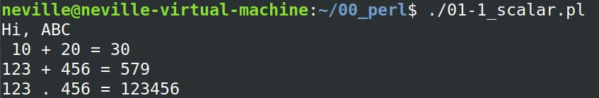

# 01. Basic --- [[Back]](https://github.com/Wilhelmine21/LearningPerl#perl)
## Some suggestions from ChatGPT
* Perl is a high-level, interpreted language used for scripting and data manipulation. It's often used for web development, text processing, and system administration.
### Here are the basics of Perl programming:
#### Variables: 
* In Perl, you can declare a variable with the "$" symbol. For example, to declare a variable named "myVariable" with a value of 10, you would write "$myVariable = 10;".

#### Data Types: 
* Perl has several data types, including scalars (which store a single value), arrays (which store multiple values), and hashes (which store key-value pairs).

#### Control structures: 
* Perl has various control structures, including if-else statements, loops (for, while, until), and more.

#### Operators: 
* Perl has various operators, including arithmetic operators (+, -, *, /), comparison operators (==, !=, >, <), and more.

#### Subroutines: 
* In Perl, you can define your own subroutines to encapsulate a block of code. You can then call these subroutines later in your code.

#### Regular Expressions: 
* Perl has a rich set of features for working with regular expressions, which are patterns used to match and manipulate strings.
---
* This is just a brief overview of the basics of Perl programming. There is much more to learn, but these basics should give you a good starting point.
## 01-1 Scalar & String
* Example:
    ```perl
    #!/usr/bin/perl -w
    $str1="ABC";
    print "Hi, $str1\n";
    
    $num1 = 10;
    $num2 = 20;
    $sum12 = $num1 + $num2;
    print " $num1 + $num2 = $sum12\n";

    $str_num1 = 123;
    $str_num2 = 456;
    print "$str_num1 + $str_num2 = ",$str_num1+$str_num2,"\n";
    print "$str_num1 . $str_num2 = ",$str_num1.$str_num2,"\n";
    ```
* Terminal:
</br></br>

## 01-2 chomp() & defined()
* delete '\n':
    ```perl
    chomp($data);
    ```
* check var:
    ```perl
    defined($data);
    ```
* Example:
    ```perl
    #!/usr/bin/perl -w
    if (defined($data)){
        print $data;
    }else{
        print "Undefined!\n";
    }
    ```
* Terminal:
</br></br>

## 01-3 Array
* Example:
    ```perl
    #!/usr/bin/perl -w
    @array = qw/data1 data2 data3/;
    @array_1_10 = (1..10);
    print "@array\n";
    print "@array_1_10\n";

    @array2 = (1, 2, 3);
    $array2[19] = 20;
    print "$array2[1]\n";
    print "$array2[19]\n";
    # array2 len 3 ---> 20
    # index 0,1,2,20 -> values
    # others -> undef!

    @array3 = (11, 22, 33, 44, 55);
    $array3[6] = "66";
    print "$#array3\n";
    print "$array3[5]\n"; # undef!
    ```
* Terminal:
</br></br>

<!-- ## 01-
* Example:
    ```perl
    #!/usr/bin/perl -w

    ```
* Terminal:
</br></br> -->

