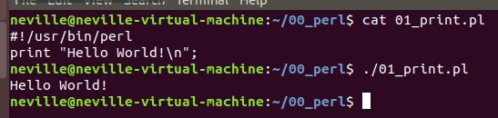

# Perl
* Because Python is too time-consuming to process large files (i.e., 20GB), I decided to learn perl.
* Because perl has a better effect in the linux environment, the following programs are all run under ubuntu.
* xxx.pl
    * line 0
        ```perl
        #!/usr/bin/perl
        ```

## First program
* Hello word!
    ```perl:
    print "Hello World!\n"; 
    ```
* Terminal</br>
    
</br>