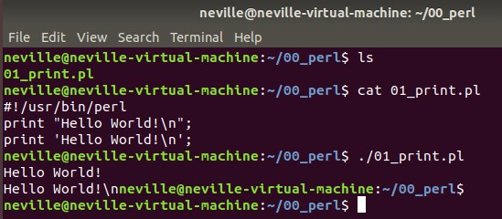

# Perl
* Because Python is too time-consuming to process large files (i.e., 20GB), I decided to learn perl.
* Because perl has a better effect in the linux environment, the following programs are all run under ubuntu.
* xxx.pl
    * line 1
        ```perl
        #!/usr/bin/perl -w
        ```
    * "-w" means it will display a warning if there is a problem running the perl file.
## Something can help you to debug...
* use warnings;
* use strict;
* Notes: The commands will increase the run time.

## First program
* Hello word!
    ```perl
    print "Hello World!\n"; 
    print 'Hello World!\n'; 
    # '\n' will be displayed in the terminal
    ```
* Terminal</br>
    
</br>

## List
* [01_scalar](https://github.com/Wilhelmine21/LearningPerl/tree/main/01_basic#01-basic-----back)